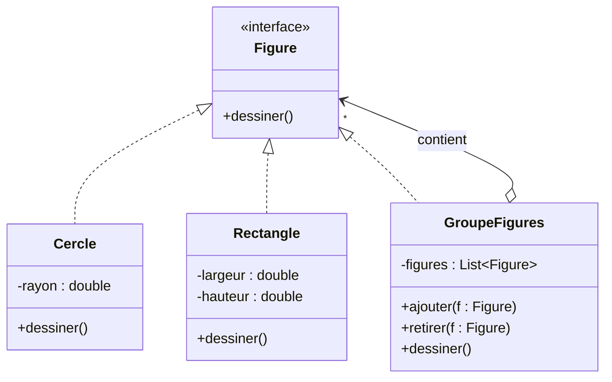
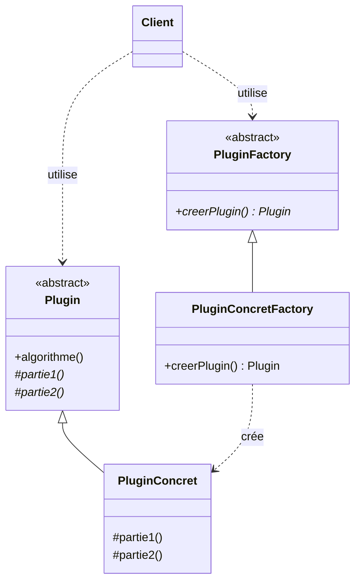
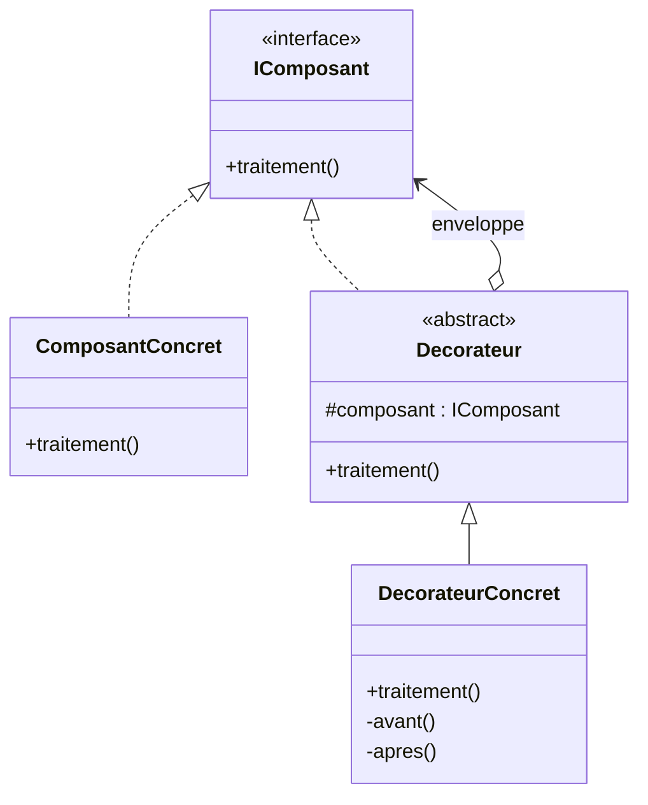
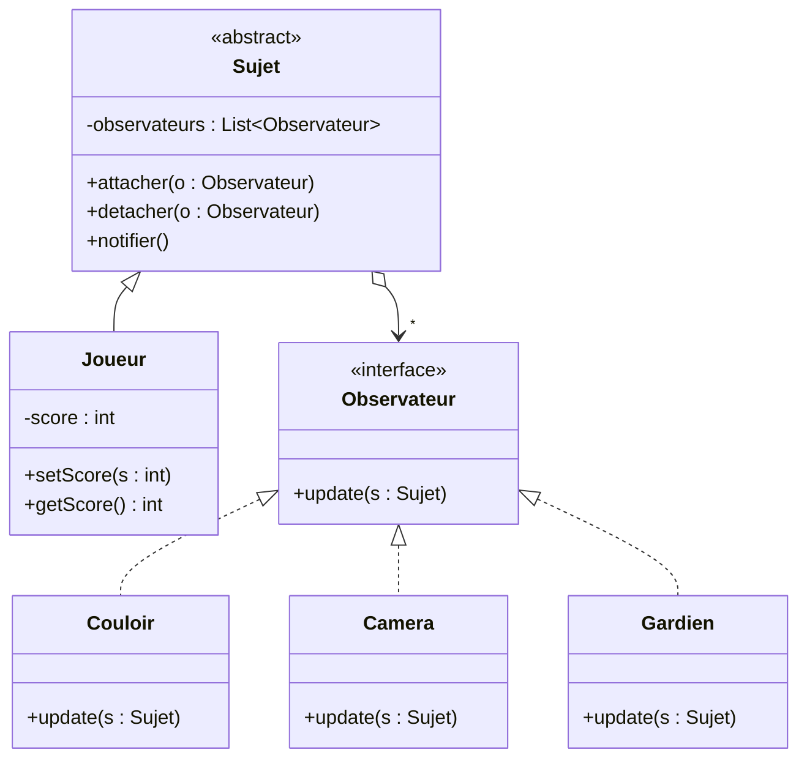
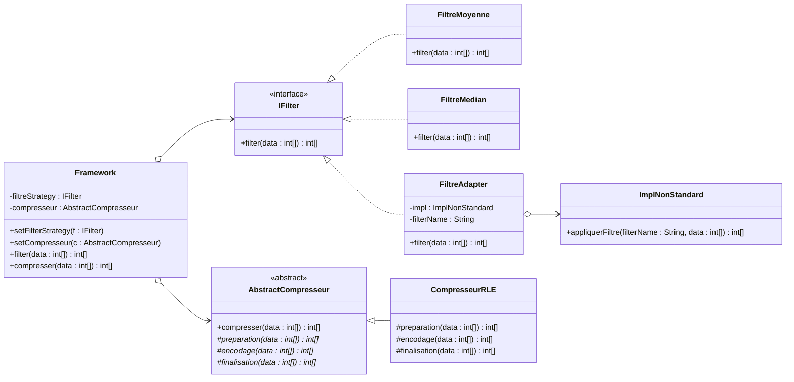

# TD Design Patterns
> **Sujet :** Application des Design Patterns du GoF à des situations concrètes et conception d'un Framework de traitement d'image.

---

## Exercice 1 — Identification de patterns

### 1.1 Une figure peut être soit un cercle, un rectangle ou un groupe de figures.

**Pattern utilisé :** `Composite` — il permet de traiter de manière uniforme un objet simple (feuille) et une composition d'objets (composite).

#### Diagramme UML



**Justification :**
- `Figure` est le **Component** (interface commune).
- `Cercle` et `Rectangle` sont les **Leaf** (feuilles).
- `GroupeFigures` est le **Composite** : il contient une collection de `Figure` et délègue récursivement l'appel à `dessiner()`.

---

### 1.2 Plugin avec algorithme squelette et instanciation sans connaître la classe**

**Énoncé :** Un plugin contient une opération qui implémente le squelette d'un algorithme dont deux parties (`partie1`, `partie2`) sont variables. Le client doit pouvoir instancier un plugin concret sans connaître sa classe.

**Patterns utilisés :**
- **Template Method** : pour fixer le squelette de l'algorithme et déléguer les parties variables aux sous-classes.
- **Factory Method** : pour permettre au client d'obtenir une instance concrète sans dépendre de sa classe.

#### Diagramme UML



**Justification :**
- La méthode `algorithme()` (template) appelle dans un ordre fixe `partie1()` puis `partie2()`, qui sont abstraites.
- `PluginConcret` redéfinit uniquement ce qui varie.
- `PluginFactory` masque la classe d'implémentation au client.

---

### 1.3 Ajout dynamique de responsabilités sans modifier le code source

**Énoncé :** Rattacher dynamiquement des responsabilités supplémentaires à un composant (avant et après l'exécution de `traitement()`) sans modifier son code source.

**Pattern utilisé :** `Decorator` — enveloppe l'objet pour étendre son comportement de façon transparente.

#### Diagramme UML



**Justification :**
- Le `Decorateur` implémente la même interface que `IComposant` et contient une référence vers un `IComposant`.
- `DecorateurConcret.traitement()` exécute `avant()` → `composant.traitement()` → `apres()`.
- Plusieurs décorateurs peuvent être empilés (composition récursive).

---

### 1.4 Notification des changements de score du Joueur (faible couplage)

**Énoncé :** Une classe `Joueur` possède un `score`. Les objets `Couloir`, `Caméra`, `Gardien` doivent être notifiés à chaque changement de score, avec un couplage faible.

**Pattern utilisé :** `Observer` — notification automatique 1→N avec couplage faible.

#### Diagramme UML



**Justification :**
- `Joueur` (Sujet) ne connaît que l'interface `Observateur`.
- À chaque appel `setScore()`, il invoque `notifier()` qui parcourt la liste et appelle `update()` sur chaque observateur.
- L'ajout d'un nouvel observateur (ex. `Alarme`) ne modifie pas `Joueur`.

---

## Exercice 2 — Framework de traitement d'image

### Patterns identifiés

| Exigence du Framework | Pattern appliqué |
|---|---|
| Ouvert à l'extension / fermé à la modification du filtrage | **Strategy** |
| Changer dynamiquement la version du filtre | **Strategy** |
| Réutiliser `ImplNonStandard.appliquerFiltre(String, int[])` | **Adapter** |
| Squelette de la compression, détails dans les sous-classes | **Template Method** |
| Instancier les implémentations depuis le nom de classe saisi | **Reflection / Factory** |

### Diagramme de classes



---

### Implémentation Java

#### `IFilter` — Interface Strategy

```java
package fr.framework.filter;

public interface IFilter {
    int[] filter(int[] data);
}
```

#### Deux implémentations standard de `IFilter`

```java
package fr.framework.filter;

public class FiltreMoyenne implements IFilter {
    @Override
    public int[] filter(int[] data) {
        int[] result = new int[data.length];
        for (int i = 1; i < data.length - 1; i++) {
            result[i] = (data[i - 1] + data[i] + data[i + 1]) / 3;
        }
        result[0] = data[0];
        result[data.length - 1] = data[data.length - 1];
        return result;
    }
}
```

```java
package fr.framework.filter;

import java.util.Arrays;

public class FiltreMedian implements IFilter {
    @Override
    public int[] filter(int[] data) {
        int[] result = new int[data.length];
        for (int i = 1; i < data.length - 1; i++) {
            int[] window = { data[i - 1], data[i], data[i + 1] };
            Arrays.sort(window);
            result[i] = window[1];
        }
        result[0] = data[0];
        result[data.length - 1] = data[data.length - 1];
        return result;
    }
}
```

#### `ImplNonStandard` — Ancienne implémentation incompatible

```java
package fr.framework.legacy;

public class ImplNonStandard {
    public int[] appliquerFiltre(String filterName, int[] data) {
        // Implémentation héritée non modifiable
        int[] result = new int[data.length];
        for (int i = 0; i < data.length; i++) {
            result[i] = data[i] / 2; // exemple : assombrissement
        }
        System.out.println("[Legacy] Filtre '" + filterName + "' appliqué.");
        return result;
    }
}
```

#### `FiltreAdapter` — Adapter

```java
package fr.framework.filter;

import fr.framework.legacy.ImplNonStandard;

public class FiltreAdapter implements IFilter {
    private final ImplNonStandard impl;
    private final String filterName;

    public FiltreAdapter(ImplNonStandard impl, String filterName) {
        this.impl = impl;
        this.filterName = filterName;
    }

    @Override
    public int[] filter(int[] data) {
        return impl.appliquerFiltre(filterName, data);
    }
}
```

#### `AbstractCompresseur` — Template Method

```java
package fr.framework.compress;

public abstract class AbstractCompresseur {

    /** Méthode template : ordonne les étapes de la compression. */
    public final int[] compresser(int[] data) {
        int[] prep = preparation(data);
        int[] encode = encodage(prep);
        return finalisation(encode);
    }

    protected abstract int[] preparation(int[] data);
    protected abstract int[] encodage(int[] data);
    protected abstract int[] finalisation(int[] data);
}
```

#### `CompresseurRLE` — Implémentation concrète

```java
package fr.framework.compress;

import java.util.ArrayList;
import java.util.List;

public class CompresseurRLE extends AbstractCompresseur {

    @Override
    protected int[] preparation(int[] data) {
        // Aucune préparation particulière : on retourne la donnée telle quelle.
        return data;
    }

    @Override
    protected int[] encodage(int[] data) {
        // Run-Length Encoding : [valeur, nb_répétitions, valeur, nb_répétitions, ...]
        List<Integer> encoded = new ArrayList<>();
        int i = 0;
        while (i < data.length) {
            int count = 1;
            while (i + count < data.length && data[i + count] == data[i]) {
                count++;
            }
            encoded.add(data[i]);
            encoded.add(count);
            i += count;
        }
        return encoded.stream().mapToInt(Integer::intValue).toArray();
    }

    @Override
    protected int[] finalisation(int[] data) {
        System.out.println("[RLE] Compression terminée, taille = " + data.length);
        return data;
    }
}
```

#### `Framework` — Classe principale

```java
package fr.framework;

import fr.framework.compress.AbstractCompresseur;
import fr.framework.filter.IFilter;

public class Framework {

    private IFilter filtreStrategy;
    private AbstractCompresseur compresseur;

    public void setFilterStrategy(IFilter filtreStrategy) {
        this.filtreStrategy = filtreStrategy;
    }

    public void setCompresseur(AbstractCompresseur compresseur) {
        this.compresseur = compresseur;
    }

    public int[] filter(int[] data) {
        if (filtreStrategy == null) {
            throw new IllegalStateException("Aucune stratégie de filtre définie.");
        }
        return filtreStrategy.filter(data);
    }

    public int[] compresser(int[] data) {
        if (compresseur == null) {
            throw new IllegalStateException("Aucun compresseur défini.");
        }
        return compresseur.compresser(data);
    }
}
```

---

### Application cliente

Le client saisit dynamiquement les **noms complets** des classes d'implémentation à utiliser. Le Framework les instancie via la **réflexion**.

```java
package fr.framework.app;

import fr.framework.Framework;
import fr.framework.compress.AbstractCompresseur;
import fr.framework.filter.IFilter;

import java.util.Arrays;
import java.util.Scanner;

public class Application {

    public static void main(String[] args) throws Exception {
        Scanner sc = new Scanner(System.in);
        Framework framework = new Framework();

        System.out.print("Nom complet de la classe IFilter à utiliser : ");
        String filterClass = sc.nextLine().trim();
        // Exemples valides :
        //   fr.framework.filter.FiltreMoyenne
        //   fr.framework.filter.FiltreMedian

        System.out.print("Nom complet de la classe AbstractCompresseur à utiliser : ");
        String compClass = sc.nextLine().trim();
        // Exemple : fr.framework.compress.CompresseurRLE

        // Instanciation dynamique
        IFilter filter = (IFilter) Class.forName(filterClass)
                                        .getDeclaredConstructor()
                                        .newInstance();
        AbstractCompresseur compresseur = (AbstractCompresseur) Class.forName(compClass)
                                        .getDeclaredConstructor()
                                        .newInstance();

        framework.setFilterStrategy(filter);
        framework.setCompresseur(compresseur);

        int[] image = { 10, 10, 10, 20, 20, 30, 30, 30, 30, 40 };

        System.out.println("Image originale  : " + Arrays.toString(image));

        int[] filtree = framework.filter(image);
        System.out.println("Image filtrée    : " + Arrays.toString(filtree));

        int[] compressee = framework.compresser(filtree);
        System.out.println("Image compressée : " + Arrays.toString(compressee));

        // Changement dynamique de stratégie :
        framework.setFilterStrategy(new fr.framework.filter.FiltreAdapter(
                new fr.framework.legacy.ImplNonStandard(),
                "assombrir"
        ));
        System.out.println("Via Adapter      : " + Arrays.toString(framework.filter(image)));
    }
}
```

#### Exemple d'exécution

```
Nom complet de la classe IFilter à utiliser : fr.framework.filter.FiltreMoyenne
Nom complet de la classe AbstractCompresseur à utiliser : fr.framework.compress.CompresseurRLE
Image originale  : [10, 10, 10, 20, 20, 30, 30, 30, 30, 40]
Image filtrée    : [10, 10, 13, 16, 23, 26, 30, 30, 33, 40]
[RLE] Compression terminée, taille = 16
Image compressée : [10, 2, 13, 1, 16, 1, 23, 1, 26, 1, 30, 2, 33, 1, 40, 1]
[Legacy] Filtre 'assombrir' appliqué.
Via Adapter      : [5, 5, 5, 10, 10, 15, 15, 15, 15, 20]
```

---

## Résumé des patterns appliqués

| Exercice | Pattern(s) | Famille (GoF) |
|---|---|---|
| 1.1 Figure | **Composite** | Structurel |
| 1.2 Plugin | **Template Method** + **Factory Method** | Comportemental + Création |
| 1.3 Composant enveloppé | **Decorator** | Structurel |
| 1.4 Joueur / environnement | **Observer** | Comportemental |
| 2 Framework | **Strategy** + **Adapter** + **Template Method** (+ Reflection) | Comportemental + Structurel |

---

